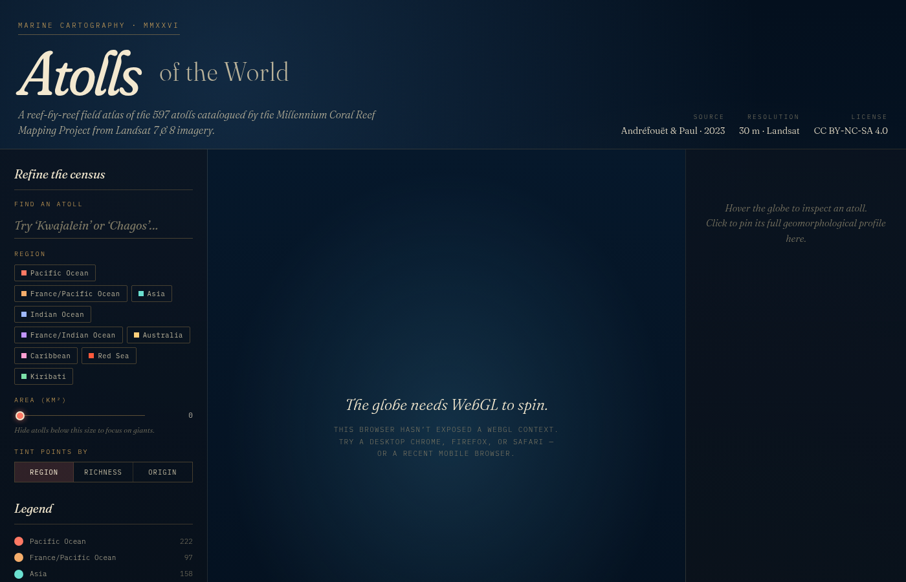

# coral-atoll

An interactive field atlas of the **597 atolls** catalogued worldwide by the
Millennium Coral Reef Mapping Project (MCRMP). A 3D globe in the browser plus
a cleaned, joined, machine-readable dataset distilled from the seven DataSuds
releases that accompany Andréfouët & Paul (2023).

> Andréfouët, S. & Paul, M. (2023). *Atolls of the world: A reappraisal from
> an optical remote sensing and global mapping perspective.* Marine Pollution
> Bulletin 194, 115400. <https://doi.org/10.1016/j.marpolbul.2023.115400>

License: **CC BY-NC-SA 4.0** for everything in the repo. See `LICENSE.md`.

---

## What's inside

```
coral-atoll/
├── web/                        # Static GitHub-Pages-ready site
│   ├── index.html
│   ├── style.css
│   ├── globe.js                # Globe.gl + d3 driver
│   └── data/atolls.json        # 597 atolls joined & cleaned (783 KB)
├── data/processed/
│   └── atolls.json             # pretty-printed copy of the same payload
├── scripts/
│   └── build_atolls_json.py    # rebuild atolls.json from references/
├── references/                 # untouched source archives
│   ├── 113397.pdf              # author-produced PDF of the paper
│   ├── dataverse_files.zip     # statistics package (DataSuds OKTEFB)
│   ├── dataverse_files/        # …unzipped, used by the build script
│   └── gis_raw/                # 6 regional GIS bundles (~74 MB total)
│       ├── Asia.zip
│       ├── Australia.zip
│       ├── Caribbean.zip
│       ├── France.zip
│       ├── Indian.zip
│       └── Pacific.zip
├── screenshots/                # rendered samples
├── LICENSE.md
└── README.md
```

---

## The interactive globe

A 3D Globe.gl visualisation of all 597 atolls. Points are sized by total km²
(log-scaled) and coloured by region, geomorphological richness, or oceanic /
continental origin. Hover for a tooltip; click an atoll to pin its full L4-class
breakdown in the right rail.

To preview locally:

```bash
cd web
python3 -m http.server 8000
# then open http://localhost:8000 in any WebGL-capable browser
```

To publish on **GitHub Pages**: push this repo, then in *Settings → Pages*
point the source at `main` branch, folder `/web`. Globe.gl, Three.js, and the
country outlines come from public CDNs (jsdelivr / unpkg) — no build step
required.

The first-pass design is a deep-sea editorial atlas: Fraunces display italics,
IBM Plex Mono data labels, abyssal navy + coral + brass palette, slow auto-rotate
on idle, custom HTML tooltips, three colour-mode segmented control.



*(Screenshot taken in headless Termux Chromium which has no WebGL — the centre
is a graceful fallback. The globe itself renders in any normal browser.)*

---

## The cleaned dataset

`web/data/atolls.json` is the single canonical join of:

1. **Statistics — `Atolls_Statistics-598.xlsx`** (DataSuds OKTEFB)
   - sheet *L5 km2*: km² per L5 geomorphological code per atoll
   - sheet *L4 km2*: km² per L4 named class per atoll
2. **Geocoordinates — `Lat-Long_atolls-598.csv`**
3. **Code lookup — `Millennium-Codes-Reefbase-2023-Atoll-Codes.xlsx`**

Each record looks like:

```json
{
  "name": "Great Chagos Bank",
  "region": "Indian Ocean",
  "archipelago": "Chagos",
  "lat": -6.24623,
  "lon": 72.15432,
  "area_km2": 12810.893,
  "l5_classes_n": 16,
  "l4": { "deep lagoon": 8754.2, "forereef": 312.1, … },
  "l5": {
    "2":  {"label": "drowned inner slope", "l3": "Drowned atoll",
           "l2": "Oceanic atoll", "l1": "oceanic",
           "reef": false, "depth": "deep", "land": false, "km2": 1355.117},
    …
  }
}
```

### What was cleaned

| Issue | Resolution |
|---|---|
| L4 sheet had **Taka Garlarang** (Indonesia) and **Cato Reef** (Australia) row-values 10⁶× too large — stored in m² instead of km² | Divided those two rows by 10⁶ at build time. L5 sheet was already correct. Verified via cross-check: only 2 of 588 atolls present in both sheets mismatched, both with a perfect 1,000,000× ratio. |
| 70 atolls had name mismatches between the lat-long CSV and the stats xlsx (suffix differences like `Addu` vs `Addu Atoll`, French/English variants like `Récif Bellona` vs `Bellonareef`, typos like `Earl Dalhousle Bank` vs `Earl Dalhousie Bank`) | Three-tier matcher in `scripts/build_atolls_json.py`: exact → aggressive keyize (deaccent, drop EN/FR/Indonesian geo-prefixes & suffixes, collapse punctuation) → fuzzy via `difflib`. Resolves **589 / 597 atolls** to coordinates. |
| 8 residual unmatched atolls are degenerate duplicates (`F`, `North Reef`, `Pukapuka` ×2, `Unnamed Atoll 1/2/3` ×3 each) that share names within the source | Left without coordinates; recorded in the JSON as `lat: null, lon: null`. |
| Paper text claims 598 atolls; the actual published spreadsheet has 597 rows | Reported as `n: 597` in the JSON payload to match the data, not the abstract. |

### Rebuilding

```bash
pip install openpyxl
python3 scripts/build_atolls_json.py
```

---

## The 6 regional GIS bundles (~74 MB)

Each `references/gis_raw/<Region>.zip` unzips to `MCRMP/<Region>/` containing
**per-country zipped shapefiles** (e.g. `Indonesia-77.zip`). Each per-country
zip in turn holds one shapefile **per atoll** (`.shp`, `.shx`, `.dbf`, `.prj`).
Polygons carry the full L1–L5 geomorphic attribute set used to compute the
statistics.

| Region | DOI | Size | Atolls |
|---|---|--:|--:|
| Statistics + docs | 10.23708/OKTEFB | 153 KB | – |
| Asia | 10.23708/ANJCRV | 8.7 MB | 158 |
| Australia | 10.23708/JXNMFY | 2.3 MB | 29 |
| Caribbean & Atlantic | 10.23708/6ZNSA3 | 3.8 MB | 11 |
| France | 10.23708/LHTEVZ | 17.0 MB | 102 |
| Indian Ocean & Red Sea | 10.23708/OCEC0S | 14.6 MB | 56 |
| Pacific Ocean | 10.23708/OS20O0 | 27.6 MB | 245 |

> The paper quotes the Pacific DOI as `OS2OO0` — that's a typo. The working
> DataSuds identifier is `OS20O0` (O→0 in the third character).

Polygon conversion to GeoJSON / vector tiles isn't wired into the build yet
— it's the obvious next layer for the globe (drop in atoll outlines on
zoom-in). `pyshp` is the lightest pure-Python path; `ogr2ogr` (GDAL) is the
fast one.

---

## Roadmap

1. **Polygons on the globe** — unpack the regional zips, convert each
   per-atoll shapefile to a simplified GeoJSON, fetch and render on zoom-in.
2. **Geomorphological-richness ordination** — reproduce and extend Figure 5
   of the paper (MDS / PCA on row-normalised L4 surface fractions across all
   597 atolls, not just Spratly / Maldives / French Polynesia).
3. **External-layer joins** — climate vulnerability (NOAA Coral Reef Watch
   SST anomalies), population exposure (WorldPop), conservation gap (WDPA
   MPAs), biodiversity (GBIF / OBIS).
4. **Storytelling layer** — long-form scrolly entries on the largest atolls
   (Great Chagos Bank, Bellona, Kwajalein, Maldives, Takabonerate).

---

## Attribution

Underlying data © Serge Andréfouët, IRD / UMR ENTROPIE, redistributed under
CC BY-NC-SA 4.0. The MCRMP was funded by NASA (NAG5-10908, CARBON-0000-0257)
and IRD. See `LICENSE.md` for full attribution requirements.
